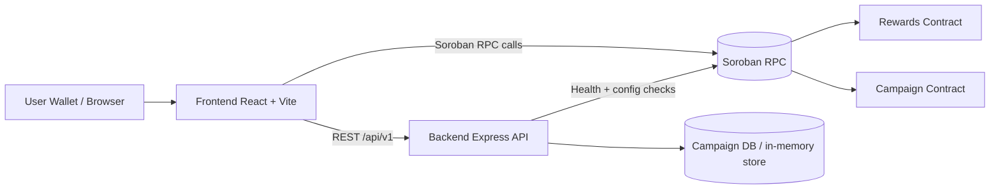

# Trivela Architecture Overview

> 🔤 Unfamiliar with Soroban, XDR, instance storage, or persistent storage? See the
> **[Glossary](GLOSSARY.md)**.

This document gives contributors a quick map of the Trivela system, the trust boundaries, and how
data moves across contracts, backend, and frontend.

## System Diagram



## Component Responsibilities

- `frontend/`
  - Renders campaigns, wallet UX, and claim/register actions.
  - Handles client-side loading/error states and route-level rendering recovery.
  - Reads API and contract configuration from `VITE_*` env values.

- `backend/`
  - Serves campaign CRUD endpoints under `/api/v1`.
  - Exposes health/config/metrics endpoints for operations and integrations.
  - Applies request logging, optional API-key auth for writes, and rate limiting.

- `contracts/rewards`
  - Tracks user points, credit events, and claims.
  - Enforces contract-level authorization and reward accounting.

- `contracts/campaign`
  - Tracks campaign lifecycle and participant registration.
  - Stores campaign-level constraints enforced on-chain.

## Trust Model

- **User wallet signatures** are the source of truth for user-authorized contract actions.
- **Smart contracts** are authoritative for on-chain balances, claims, and campaign participation.
- **Backend API** is authoritative for off-chain campaign metadata served to the UI.
- **Frontend** is untrusted for business logic enforcement; it should only orchestrate and display
  state.

## Data Flows

### 1) Campaign browsing

1. Frontend calls `GET /api/v1/campaigns`.
2. Backend reads from campaign store and returns paginated data.
3. Frontend renders cards/details with loading and retry behavior.

### 2) Register in campaign

1. User connects wallet in frontend.
2. Frontend constructs/registers transaction via Soroban RPC.
3. Campaign contract validates rules and persists participant state.

### 3) Claim rewards

1. Frontend reads wallet points from rewards contract.
2. User submits claim action.
3. Rewards contract validates and updates on-chain balances/events.

### 4) Operational observability

1. Health checks: `/health`, `/health/rpc`.
2. Metrics scrape: `/metrics` (request totals, errors, route hit counters, uptime gauge).
3. Distributed traces via OpenTelemetry — see below.

## Observability stack

The backend ships three independent observability channels so SRE can pick whichever lens fits the
question:

| Lens    | Surface                            | Why                                                    |
| ------- | ---------------------------------- | ------------------------------------------------------ |
| Health  | `/health`, `/health/rpc`           | Boolean liveness + RPC reachability — page-able.       |
| Metrics | Prometheus scrape at `/metrics`    | Aggregate rates / errors / latencies — dashboard-able. |
| Traces  | OpenTelemetry → OTLP/HTTP exporter | Per-request causality — debug-able.                    |

### Distributed tracing (#288)

- Bootstrap lives in [`backend/src/tracing.js`](../backend/src/tracing.js). `initTracing()` runs
  once at process start (called from `index.js` BEFORE any other import that loads `http` /
  `express`).
- Auto-instrumentation: incoming Express requests + outbound `fetch` / `http` calls.
- Manual spans for DB queries, Soroban RPC calls, and the job runner — wrapped via the exported
  `withSpan(name, attrs, fn)` helper.
- Trace context is propagated to the frontend via the `traceparent` response header (added to
  `Access-Control-Expose-Headers`).
- `/health` and `/metrics` are excluded from tracing so the trace stream isn't drowned by
  healthchecks.

#### Configuration

Set in `backend/.env`:

- `OTEL_SERVICE_NAME` — defaults to `trivela-backend`.
- `OTEL_EXPORTER_OTLP_ENDPOINT` — e.g. `http://jaeger:4318`. **Unset = no export**, but `withSpan`
  still works as a no-op.
- `OTEL_EXPORTER_OTLP_HEADERS` — comma-separated `key=value` pairs for vendors that need auth
  (Honeycomb, Lightstep, etc.).

#### Local-dev quickstart

```bash
docker compose --profile tracing up jaeger
OTEL_EXPORTER_OTLP_ENDPOINT=http://localhost:4318 npm --prefix backend run dev
open http://localhost:16686
```

## Future: upgradeability

- Keep contract IDs stable while evolving logic by using Soroban Wasm upgrades plus explicit schema
  migrations.
- Move toward a deployer/governance-controlled upgrade authority instead of relying on a single
  long-lived admin key.
- Maintain a repeatable rollout sequence: install Wasm -> upgrade -> migrate -> verify
  `schema_version`.
- Full migration details and runbook: see `docs/upgradeability.md`.
