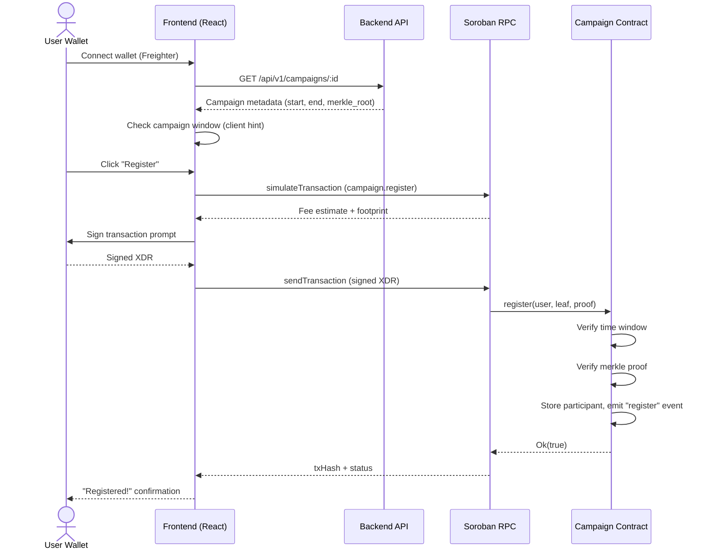
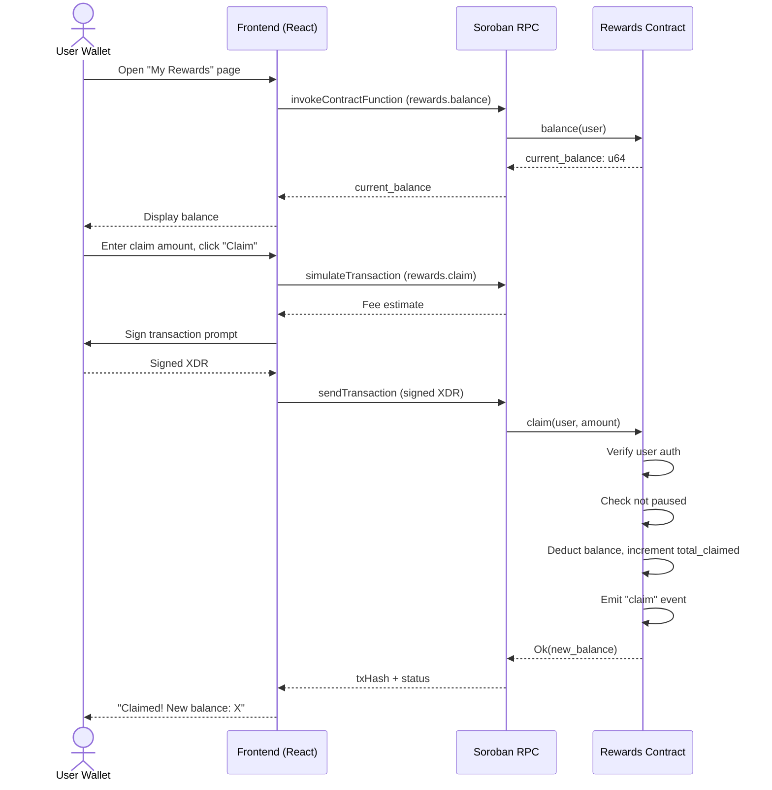
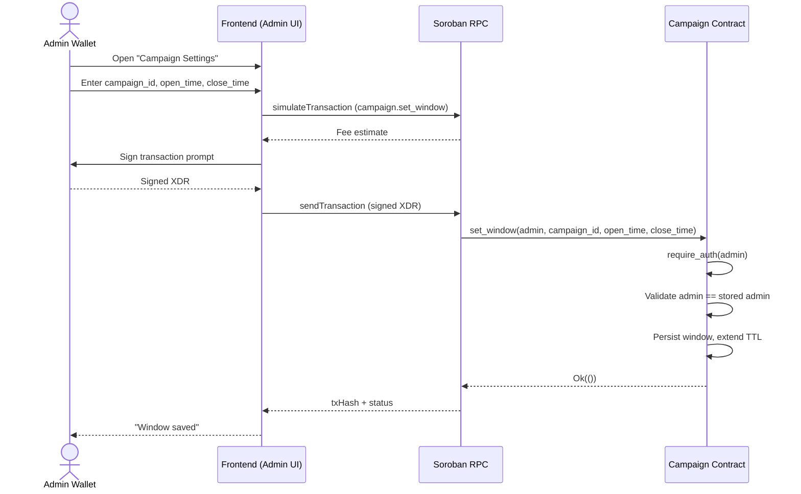
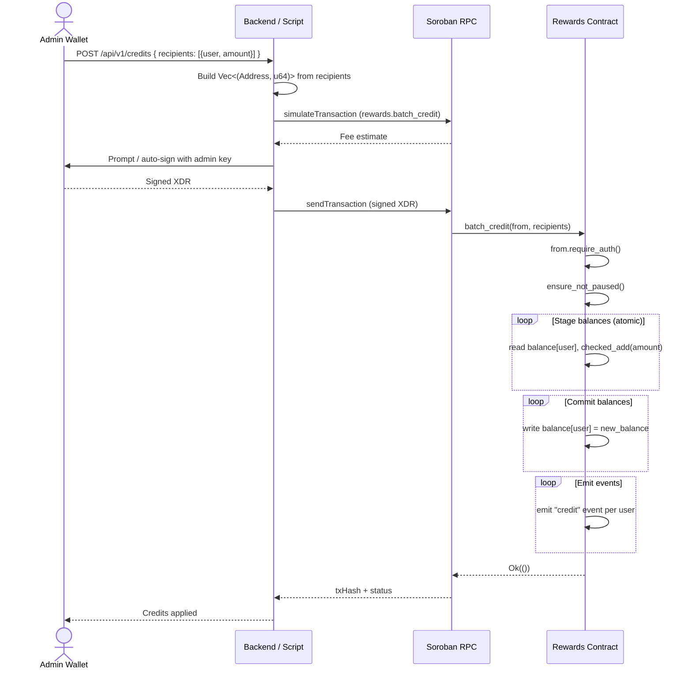
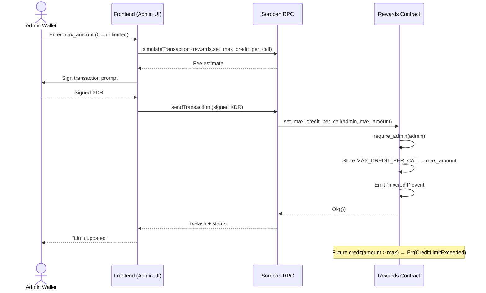

# Data Flow Diagrams

Detailed sequence diagrams for each core Trivela user journey. These complement the high-level
diagram in [ARCHITECTURE_OVERVIEW.md](ARCHITECTURE_OVERVIEW.md).

---

## 1. Campaign Registration

A user connects their wallet and registers as a participant in an active campaign.

---

## 2. Claim Rewards

A registered user claims part of their accrued points balance.

---

## 3. Admin: Set Campaign Time Window

An admin configures the open/close timestamps for campaign participation.

---

## 4. Admin: Credit Rewards (Batch)

An admin credits reward points to multiple users in a single transaction (#85).

---

## 5. Admin: Set Max Credit Per Call

An admin sets the upper bound on points per single `credit` call to prevent runaway crediting (#83).

